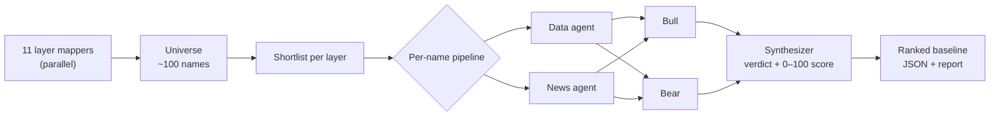
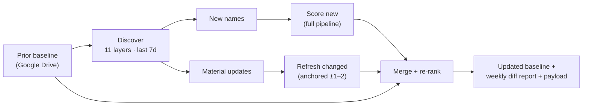
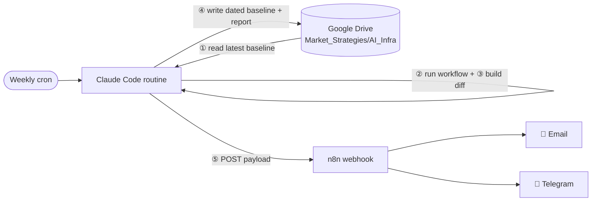

# 🤖 AI Value Chain Tracker

> A multi-agent research system that maps the **end-to-end AI-infrastructure value chain**, scores publicly-listed equities on a transparent, return-oriented composite, and runs a **weekly diff** to surface newly-investable names — built as [Claude Code](https://claude.com/claude-code) workflows.

   

---

## ✨ What it is

The AI boom is, underneath the models, a **physical supply chain** — power, datacenters, silicon, memory, networking, systems, cloud, and the apps on top. This project turns that chain into an investable, continuously-updated map:

1. 🗺️ **Maps** the chain into 11 layers and their sub-components.
2. 🏗️ **Builds a universe** of public companies with *specific* AI-infrastructure exposure (a concrete mechanism — **not** sector beta), each with a sourced, dated catalyst.
3. ⚔️ **Adversarially stress-tests** a shortlist (a bull *and* a bear agent per name) and **scores** each 0–100 on a weighted rubric.
4. 🔁 **Runs weekly** to discover *new* names and material changes, diffing against the prior baseline and emailing the delta.

> ⚠️ **Not investment advice.** Every figure is AI-generated and labelled *primary* (filing/official) vs *estimated*. Scores are opinion, directional only. Do your own research.

## 🧱 The value chain (11 layers)

| # | Layer | What it covers |
|--:|--|--|
| 1 | **Energy & Power** | generation (nuclear / SMR / gas), grid, utilities serving datacenter load |
| 2 | **Datacenter Buildout** | construction, DC REITs, cooling, electrical infrastructure |
| 3 | **Semiconductor Mfg Enablers** | foundry, advanced packaging, semicap equipment, materials |
| 4 | **Compute Silicon** | GPUs / accelerators, custom ASICs, host CPUs |
| 5 | **Memory & Storage** | HBM, DRAM, NAND / SSD |
| 6 | **Networking & Interconnect** | optical, switches / NICs, co-packaged optics, cabling |
| 7 | **Systems & Integration** | server OEM / ODM, rack-scale integrators |
| 8 | **Cloud & Compute Capacity** | hyperscalers, neoclouds |
| 9 | **Foundation Models** | mostly private — public exposure routes only |
| 10 | **Inference, Orchestration & Data Tooling** | serving, orchestration, data / observability |
| 11 | **Applications & Distribution** | AI-monetizing apps & channels |

## ⚙️ How it works

### 1 · Baseline (one-time)



Map every layer in parallel → shortlist → run each shortlisted name through an adversarial pipeline (**Data → News → Bull → Bear → Synthesizer**).

### 2 · Scoring rubric (0–100 composite)

Each name is scored 0–10 on seven dimensions, weighted to a composite. The default weights **tilt toward demand, growth and earnings momentum**, with valuation kept light (not removed):

| Dimension | Weight | Measures |
|--|--:|--|
| AI-exposure (demand size) | **22** | how direct & material the AI-infra linkage is |
| Earnings growth | **24** | revenue / EPS trajectory + backlog momentum |
| Moat / value capture | **10** | margin defensibility & competitive position |
| Valuation / risk-reward | **8** | multiple vs growth, own history & peers |
| Catalyst | **12** | durability & visibility of the driver |
| Earnings momentum | **18** | estimate revisions + sentiment tailwind |
| Risk-adjusted | **6** | inverse of execution / cyclicality risk |

**Three independent read-outs — don't conflate them:**
- 🔢 **Composite score (0–100)** — forward return potential *on the merits*.
- 🎯 **Verdict** — `underappreciated` / `fairly valued` / `priced-in` (a *mispricing* call).
- 📈 **Return potential** — high / med / low.

> A "fairly valued" name can still score high — the verdict measures *mispricing*, the score measures *return potential*.

### 3 · Weekly diff (recurring)



> 🔑 **The refresh is *anchored*** — it receives each name's prior sub-scores and adjusts deltas only (±1–2). Blind weekly re-scoring drifts +10–15 points/week (recalibration, not real moves); anchoring keeps week-over-week scores comparable.

## 🚀 Deploy as a weekly routine



1. **Read** latest `ai_value_chain_baseline_<date>.json` (+ last report for context) from Drive.
2. **Run** `workflows/ai_value_chain_weekly.js`.
3. **Merge/diff/render** with `builders/build_weekly_report.js`.
4. **Write** the dated updated baseline + weekly report back to Drive.
5. **POST** the payload to your n8n **production** webhook → email + Telegram.

> ⚠️ Use the **production** n8n webhook (`https://…/webhook/…`), **not** `/webhook-test/…` — the test URL only fires while you're actively listening in the n8n editor.

## 📂 Repository structure

```
workflows/
  ai_value_chain_baseline.js    # one-time baseline (map → adversarial deep-dive → score)
  ai_value_chain_weekly.js      # weekly discovery + anchored scoring (EMBEDDED = example stub)
builders/
  prepare_weekly.js             # prior baseline → run args + injects state into the weekly workflow
  build_baseline_report.js      # baseline workflow output → ranked JSON + markdown report
  build_weekly_report.js        # weekly workflow output → diff report + updated baseline + n8n payload
prompts/
  baseline_prompt.md            # the ultracode prompt that builds the baseline
  weekly_prompt.md              # the ultracode prompt for the weekly routine
```

## 🏁 Getting started

**Prerequisites**
- [Claude Code](https://claude.com/claude-code) — the workflows use its multi-agent `Workflow` tool and web search.
- [Node.js](https://nodejs.org) — the builders are plain Node, no dependencies.
- *(optional, for automation)* Google Drive + n8n connectors.

```bash
git clone https://github.com/alanvaa06/ai-value-chain-tracker
cd ai-value-chain-tracker
```

### Step 1 · Build the baseline (one-time)

Pick one:

- **Easiest — paste the prompt.** Open Claude Code in this repo and paste the contents of [`prompts/baseline_prompt.md`](prompts/baseline_prompt.md). The `ultracode` keyword makes Claude orchestrate the workflow: it maps all 11 layers in parallel, builds the universe, runs the adversarial deep-dive (Data → News → Bull → Bear), and scores every shortlisted name.
- **Direct — run the committed script.** Invoke the `Workflow` tool on [`workflows/ai_value_chain_baseline.js`](workflows/ai_value_chain_baseline.js), then save its returned result to `baseline_output.json`.

Render the ranked report + machine-readable baseline:

```bash
node builders/build_baseline_report.js  baseline_output.json  ./out  2026-06-03
# → ./out/ai_value_chain_baseline.json   (the universe + scores)
# → ./out/AI_Value_Chain_Report.md       (the human report)
```

> 🎚️ **Tune the rubric** by editing the `WEIGHTS` object in `builders/build_baseline_report.js`, then re-run the builder — re-ranking is instant and needs **no** new workflow run (the seven sub-scores are stored per name).

### Step 2 · Seed your store

The weekly diff reads the *latest* baseline, so date the file. If automating via Google Drive, upload to your folder renamed with the run date:

```
ai_value_chain_baseline_2026-06-03.json
ai_value_chain_report_2026-06-03.md
```

## 🔁 Weekly diff (recurring)

Each run reads the latest dated baseline, discovers only what changed in the trailing window, scores it, and writes a **new** dated baseline (so next week diffs against it). Manual run:

```bash
# 1 · inject the prior baseline into the workflow + set the 7-day window
node builders/prepare_weekly.js  prior_baseline.json  2026-06-10

# 2 · run workflows/ai_value_chain_weekly.js via Claude Code's Workflow tool,
#     then save its returned result to wf_output.json

# 3 · merge, diff, render
node builders/build_weekly_report.js  prior_baseline.json  wf_output.json  ./out  2026-06-10  3
# → ./out/ai_value_chain_baseline_2026-06-10.json
# → ./out/weekly_report_2026-06-10.md
# → ./out/ai_weekly_payload_2026-06-10.json   (the n8n body)
```

For a hands-off weekly, deploy it as a scheduled **Claude Code routine** — see [Deploy as a weekly routine](#-deploy-as-a-weekly-routine) and [`prompts/weekly_prompt.md`](prompts/weekly_prompt.md).

> The weekly script ships with a tiny **example stub** in its `EMBEDDED` constant (placeholder tickers). `prepare_weekly.js` overwrites it with your real prior state at run time — the stub is never used live.

## 📤 Outputs

| File | Purpose |
|--|--|
| `ai_value_chain_baseline_<date>.json` | ranked universe — the next run's input (state) |
| `weekly_report_<date>.md` | human report: additions / changes / follow-ups |
| `ai_weekly_payload_<date>.json` | n8n body for email + Telegram delivery |

## 📜 License

MIT © 2026 Alan Vazquez. See [LICENSE](LICENSE).

---

<sub>Built with [Claude Code](https://claude.com/claude-code) multi-agent workflows. Not affiliated with, or endorsed by, any company mentioned. **Not investment advice.**</sub>
